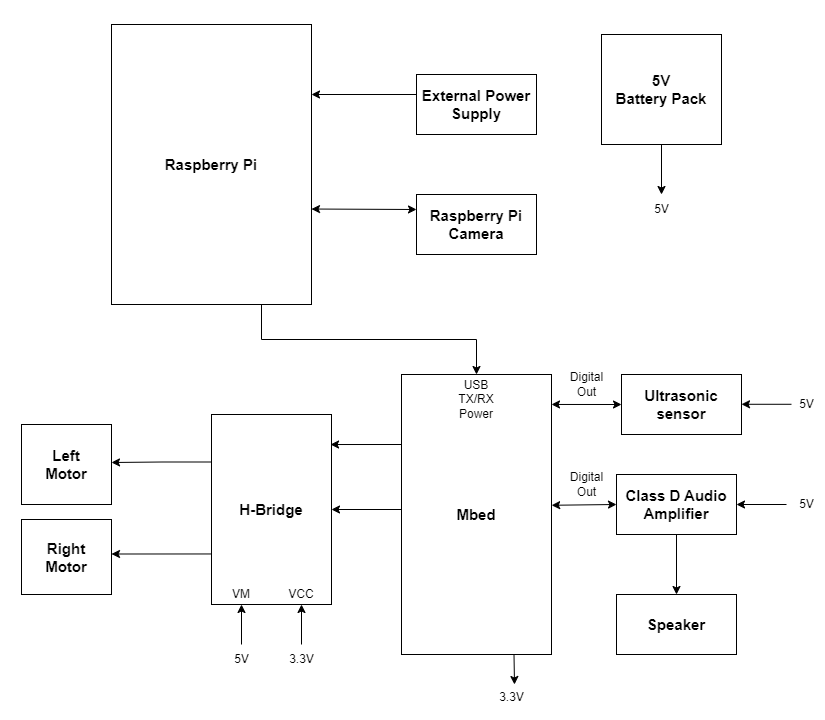

# Web-Controlled Robot With Live-Streaming Camera and Ultrasonic Obstacle Avoidance

Georgia Tech ECE 4180 Final Project

Team Members: [Prakhar Mittal](https://github.com/mittalprakhar), [Meghna Jain](https://github.com/mjain02), [Nicolas Rios](https://github.com/incordios), [Minseung Jung](https://github.com/mjung76)

## Description

We have created a robot car that can be controlled using a web page deployed using an Apache 2 web server. The user can press the forward, backward, left, right, or stop buttons on the web page to send motion commands to the car. The sensors on the robot provide 360 degree coverage. First, the robot uses a Raspberry Pi 4 to livestream video feedback from a Pi Camera mounted at the front. Moreover, an Ultrasonic sensor mounted at the rear detects and streams the distance from the closest obstacles behind. If the robot goes too close to an obstacle (<30 cm), a siren sound is played on the speakers and the robot stops automatically.

## List of Components

* Sparkfun RedBot with Shadow Chassis
* Mbed board
* Raspberry Pi (we used a Pi 4 but any Pi should work)
* Pi Camera
* TB6612FNG Dual H-Bridge
* HC-SR04 Ultrasonic Sensor
* TPA2005D1 Class D Audio Amp
* Speaker
* Two 5VDC 2A AC adapters

## Pi Camera and Web Server

To set up the Pi Camera, we used the tutorial from Lab 4: https://www.raspberrypi.org/learning/addons-guide/picamera/.

Next, we followed another tutorial from Lab 4 to create the video streaming server: http://www.instructables.com/id/How-to-Make-Raspberry-Pi-Webcam-Server-and-Stream-/.

We set up a Motion server and configured it to run on the Raspberry Pi’s IP address on Port 8081. We had to configure the server to run as a daemon and add the run commands to the rc.local file to make it run as a background process instead of waiting for the user to start it.

<code>sudo service motion restart && sudo motion</code>

## Apache2 Server

To set up the web page served by an Apache2 server, we followed the tutorial from Lab 4: https://www.raspberrypi.org/documentation/remote-access/web-server/apache.md.

All our .php files were placed in the server directory: /var/www/html.

We made an [index.php](Pi/index.php) file that has the code for the web page layout. The left half contains the snippet from the Motion server located at the Pi's IP address at port 8081 and the latest distance sensor readings from the ultrasonic sensor. The right half contains five buttons, one for each motion command, which send a Serial message to the mbed when pressed.

[ultrasonic.php](Pi/ultrasonic.php) contains the code to read the Serial port, parse any lines that start with "Rear Distance:" and echo them in the suitable div on the main web page. A JQuery function call was placed in index.php that invokes the ultrasonic.php function every half a second.
 
Each button ([forward](Pi/forward.php), [backward](Pi/backward.php), [left](Pi/left.php), [right](Pi/right.php), [stop](Pi/stop.php)) has a corresponding .php file that sends "ctrl1", "ctrl2", "ctrl3", "ctrl4", and "ctrl0" to the Serial port respectively. Ajax is used to call the suitable .php file when a button is pressed.

## Mbed Component Pinouts

 Audio Amp and Speaker
 
 |  Mbed   |  Class D Audio Amp  | Speaker | Battery Pack |
 |---------|---------------------|---------|--------------|
 |   GND   |     PWR, IN-        |         |              |
 |         |       PWR+          |         |      5V      |
 |   p18   |        IN+          |         |              |
 |         |       OUT+          |    +    |              |
 |         |       OUT-          |    -    |              |
 
 Ultrasonic Sensor
 
 |  Mbed    |   HC-SR04   |
 |----------|-------------|
 |  Vu(5V)  |     Vcc     |
 |   Gnd    |     Gnd     |
 |    p6    |     trig    |
 |    p7    |     echo    |
 
 H-Bridge and Motors
 
 |  H-Bridge  |  Mbed  |  Right Motor  |  Left Motor  |  Battery Pack  |
 |------------|--------|---------------|--------------|----------------|
 |     VM     |        |               |              |        +       |
 |    VCC     |  VOUT  |               |              |                |
 |    GND     |   GND  |               |              |        -       |
 |    STBY    |  VOUT  |               |              |                |
 |    PWMA    |   p22  |               |              |                |
 |    AIN1    |   p13  |               |              |                |
 |    AIN2    |   p12  |               |              |                |
 |    AO1     |        |       +       |              |                |
 |    AO2     |        |       -       |              |                |
 |    PWMA    |   p21  |               |              |                |
 |    AIN1    |   p11  |               |              |                |
 |    AIN2    |   p8   |               |              |                |
 |    AO1     |        |               |       +      |                |
 |    AO2     |        |               |       -      |                |

## Schematic

 

## Mbed Code

The code on the Mbed side was relatively simple. RTOS was used to handle the following tasks in parallel: reading values from the ultrasonic sensor and applying emergency stop if needed, playing siren on speaker if emergency stop is applied, and reading ctrl values from Serial and adjusting motor speeds accordingly. The full code can be found [here](Mbed/main.cpp).

## Video Demo

<video src="https://user-images.githubusercontent.com/19234681/235768128-a51384a7-8ea1-4e86-a4a4-79c9ba064927.mp4"></video>
